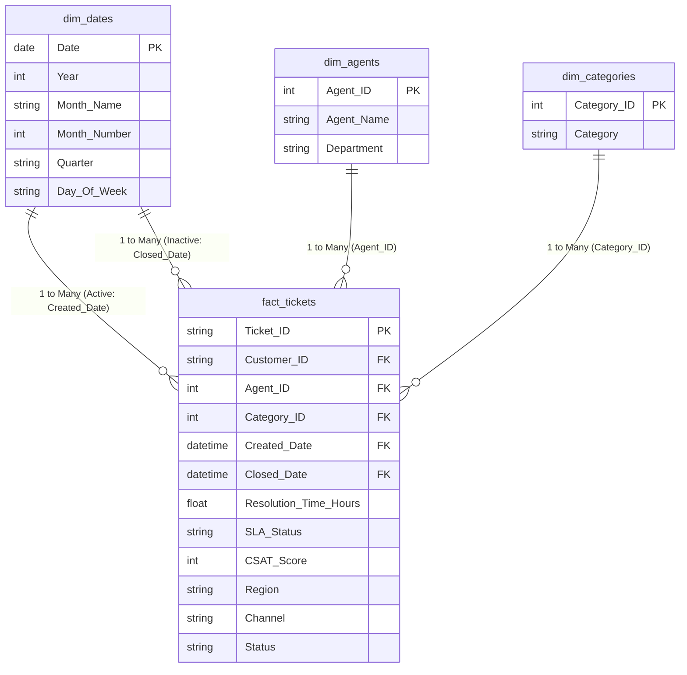

# Power BI Implementation Report: Business Intelligence & Data Modeling
**Project: Customer Support Insights Dashboard**  
**Directory: `PowerBI/`**

This report documents the data modeling, DAX measurements, and visual layout design implemented in Power BI to construct the Customer Support Insights Dashboard.

---

## 1. Data Model Architecture (Star Schema)

Rather than importing a single flat table (which leads to redundant memory usage and slower visual loading), the dataset was structured into a **Star Schema**. This separates transactions (facts) from descriptive attributes (dimensions) to optimize filter contexts and rendering performance:

### Key Modeling Configurations Applied:
1. **Dimension Tables Extraction (Power Query)**:
   * **`dim_agents`**: Extracted from the source data to hold unique combinations of `Agent_Name` and `Department`, mapped to a numeric key (`Agent_ID`).
   * **`dim_categories`**: Extracted to map each ticket `Category` to a numeric key (`Category_ID`).
   * **`dim_dates` (Calendar Table)**: Programmed using Power Query M script to support Time Intelligence metrics. Marked as the official Date Table.
2. **Relationships Configuration**:
   * All relationships between the dimensions and fact table are configured as **1-to-Many (`1:*`)** with a **Single cross-filter direction** to avoid filter context bugs.
3. **Handling Role-Playing Dates**:
   * Power BI does not allow multiple active connections between the same tables to prevent circular paths. 
   * **Active Relationship**: Connects `dim_dates[Date]` to `fact_tickets[Created_Date]`.
   * **Inactive Relationship**: Connects `dim_dates[Date]` to `fact_tickets[Closed_Date]`. This is activated dynamically via DAX when calculating resolution and survey metrics.
4. **Usability Enhancements**:
   * Hid all raw ID columns (like `Agent_ID` and `Category_ID`) from the Report View to keep the field list clean for end-users.
   * Sorted `Month_Name` in `dim_dates` by `Month_Number` to prevent alphabetical calendar sorting.

---

## 2. DAX Measures Library

The support KPIs are built using custom **DAX (Data Analysis Expressions)** measures. Measures calculate dynamically on-the-fly based on report filters (slicers and chart clicks) rather than using static column storage:

| Measure Name | DAX Code | Business Logic & Context |
| :--- | :--- | :--- |
| **Total Tickets** | `COUNTROWS(fact_tickets)` | Counts unique support ticket rows in the fact table. |
| **Closed Tickets** | `CALCULATE([Total Tickets], fact_tickets[Status] = "Closed")` | Filters the ticket counts to show only completed records. |
| **Open Tickets** | `CALCULATE([Total Tickets], fact_tickets[Status] <> "Closed")` | Counts active support tickets remaining in the queue backlog. |
| **SLA Met Tickets** | `CALCULATE([Total Tickets], fact_tickets[SLA_Status] = "Met")` | Counts tickets that met response/resolution time guarantees. |
| **SLA Compliance %** | `DIVIDE([SLA Met Tickets], [Total Tickets], 0)` | Computes the proportion of tickets that met SLAs (displays as percentage). |
| **Avg Resolution Time (Hrs)** | `CALCULATE(AVERAGE(fact_tickets[Resolution_Time_Hours]), USERELATIONSHIP(dim_dates[Date], fact_tickets[Closed_Date]))` | Averages resolution hours. Uses `USERELATIONSHIP` to filter date dimensions by *closure/resolution date* rather than creation date. |
| **Average CSAT** | `CALCULATE(AVERAGE(fact_tickets[CSAT_Score]), USERELATIONSHIP(dim_dates[Date], fact_tickets[Closed_Date]))` | Averages satisfaction scores. Also uses `USERELATIONSHIP` to tie satisfaction ratings to the month the ticket was closed. |
| **Total Tickets Prev Month** | `CALCULATE([Total Tickets], PREVIOUSMONTH(dim_dates[Date]))` | Shifts the date filter context back by exactly one month for historical comparisons. |
| **Monthly Ticket Growth %** | `VAR Current = [Total Tickets] VAR Prev = [Total Tickets Previous Month] RETURN DIVIDE(Current - Prev, Prev, 0)` | Uses variables to calculate the Month-over-Month volume growth rate. |
| **Resolution Rate %** | `DIVIDE([Closed Tickets], [Total Tickets], 0)` | Measures queue throughput efficiency. |

---

## 3. Dashboard UI/UX Design

The dashboard was built following professional corporate UX layouts to enable immediate visual scanning.

### Layout Grid:
* **Top Header**: Hosts the dashboard title and global filters (Region, Year, Department, Priority).
* **KPI Row**: High-level visual cards detailing major metrics (Total Tickets, Closed, Open, SLA%, Avg Resolution, Avg CSAT).
* **Middle Section (Trends & Focus)**:
  * *Monthly Ticket Volume* (Area Chart): Showing trend shifts over time.
  * *Tickets by Priority* (Donut Chart): Quick percentage splits (Low, Medium, High, Urgent).
* **Bottom Section (Granular breakdowns)**:
  * *Agent Performance Matrix*: Rows listing agent names, displaying Closed Tickets, Avg CSAT, and Avg Resolution Time.
  * *Tickets by Category* (Bar Chart): Highlights volume bottlenecks (e.g. resets, payment issues).
  * *SLA % by Channel* (Column Chart): Performance comparison between phone, email, chat, etc.

### Visual Styling Details:
* **Palette Theme**: Sleek dark mode using `#111625` (midnight canvas) and `#1D2436` (slate cards) to reduce eye fatigue and make colored metrics stand out.
* **Conditional Formatting**:
  * Added dynamic background scales to `Average CSAT` (gradient highlighting values below `4.0` in soft red and above in soft green).
  * Added conditional scales to `Average Resolution Time` (highlighting times exceeding `48 hours` in red).
  * Applied visual data bars on the `Closed Tickets` column inside the matrix to highlight high-performing agents instantly.
