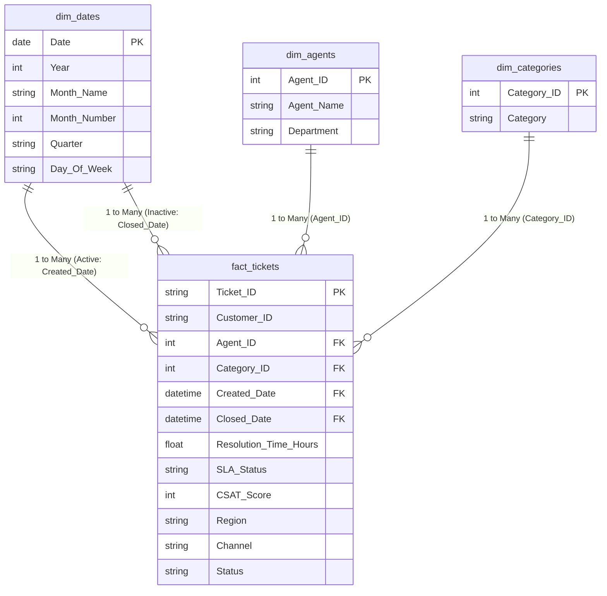

# Customer Support Insights Dashboard
    
---

## 1. Project Overview & Problem Statement

### The Problem
The Customer Support department lacks a centralized, standardized dashboard to monitor operational metrics. Support leadership cannot easily track ticket distributions, agent capacity, resolution times, or customer satisfaction (CSAT) trends. This leads to:
* Unbalanced ticket allocation and agent burnout.
* SLA (Service Level Agreement) breaches going undetected.
* Inability to target training programs for struggling agents.
* Poor visibility into what factors drive customer dissatisfaction.

### The Solution
This project establishes a complete data analytics pipeline. We clean raw, noisy support ticket data using **SQL**, perform exploratory analysis and build static tools in **Excel**, design a star-schema relationship model in **Power BI**, and compile detailed **Executive Reports** containing actionable recommendations for support leadership.

---

## 2. Project Scope & Deliverables

### In Scope:
* **Relational Database Design**: Creating permissive staging and strict production tables in SQL (MySQL & SQLite compatible).
* **Data ETL & Cleaning**: Deduplicating records, resolving spelling typos, and casting datatypes using window functions and CASE logic.
* **SQL Exploratory Analysis**: Querying key statistics (growth rates, CSAT, agent rankings) from basic to advanced CTEs.
* **Excel Dashboard Modeling**: Creating pivot tables, numeric formatting, conditional styling, and building a custom search tool using `XLOOKUP`.
* **Power BI Star Schema**: Extracting dimension tables (`dim_agents`, `dim_categories`, `dim_dates`) and connecting relationships.
* **UI/UX Design**: Structuring visual cards, trends, matrices, and donut charts.

---

## 3. Technologies Used
* **Database Engine**: SQL (MySQL schema scripts / SQLite pipeline runner)
* **Python (ETL / Automation)**: Custom Python runner (`run_pipeline.py`) utilizing `sqlite3` and `openpyxl` to build relational schemas and Excel workbooks programmatically.
* **Microsoft Excel**: Pivot Tables, Charts, Data Validation, and formulas (`COUNTIFS`, `AVERAGE`, `XLOOKUP`, `IF`).
* **Power BI Desktop**: Power Query, DAX measures, Data Modeling (Star Schema), and Interactive visuals.
* **Git/GitHub**: Version control and documentation hosting.

---


---

## 4. Core Relational Database & Star Schema

The project shapes data from a flat CSV format into an optimized, space-efficient **Star Schema** to improve DAX calculation speeds:



---

## 5. Key SQL Code Snippets

### A. Data Cleaning & Deduplication (ETL)
*Extracts raw log rows and drops 5 duplicate tickets based on their first logging timestamp:*
```sql
WITH DeduplicatedStaging AS (
    SELECT *,
           ROW_NUMBER() OVER (
               PARTITION BY Ticket_ID 
               ORDER BY Created_Date ASC
           ) as row_num
    FROM tickets_staging
)
INSERT INTO tickets
SELECT Ticket_ID, Customer_ID, Agent_Name, Department, Priority, Category,
       Created_Date, Closed_Date, Resolution_Time_Hours, SLA_Status, CSAT_Score,
       Region, Channel, Status
FROM DeduplicatedStaging
WHERE row_num = 1;
```

### B. Agent Performance Rankings (DENSE_RANK Window Function)
*Ranks agents inside each department based on average CSAT scores, handling ties:*
```sql
WITH AgentCSATRankings AS (
    SELECT 
        Department,
        Agent_Name,
        ROUND(AVG(CSAT_Score), 2) AS avg_csat,
        COUNT(*) AS total_closed_tickets,
        DENSE_RANK() OVER (
            PARTITION BY Department 
            ORDER BY AVG(CSAT_Score) DESC, COUNT(*) DESC
        ) AS csat_rank
    FROM tickets
    WHERE Status = 'Closed' AND CSAT_Score IS NOT NULL
    GROUP BY Department, Agent_Name
)
SELECT Department, Agent_Name, avg_csat, total_closed_tickets, csat_rank
FROM AgentCSATRankings
WHERE csat_rank <= 2;
```

---

## 6. Quantified KPI Summary

After pipeline execution, our database displays the following baseline KPIs:

* **Total Tickets**: 2,500 (5 duplicates dropped from the raw 2,505).
* **Open Tickets Backlog**: 300 (12% backlog rate).
* **SLA Compliance Rate**: 78.44% (SLA target is 80.00%).
* **Average CSAT**: 4.15 / 5.00 (Exceeded standard target of 4.00).
* **Average Resolution Duration**: 41.50 hours.

---

## 7. Summary of Key Business Insights
* **Technical department** handles the highest ticket volume (**647 tickets**) and has the highest SLA breach rate (**36.01%**), driven by high-complexity categories like *System Bug* and *Integration Error*.
* **Chat support** is our most vulnerable queue with a **23.03% SLA breach rate**, caused by response time delays during volume spikes.
* **CSAT & Speed Correlation**: Tickets resolved under 12 hours yield a high **4.64 CSAT**, while taking over 96 hours drops satisfaction to **3.01 CSAT**. Furthermore, breaching SLA drops CSAT from **4.34** to **2.40**.
* **Underperforming Agents**: 
  * *David Lee (Technical)* has technical speed issues, taking an average of **102.8 hours** per ticket.
  * *John Doe (Billing)* has soft-skills issues, averaging a low **3.01 CSAT** despite resolving tickets in under 60 hours.

---

## 8. Future Improvements Scope
* [ ] Integrate live data ingestion using Azure Data Factory or a streaming API.
* [ ] Develop NLP sentiment analysis to flag angry customer comments before they submit feedback surveys.
* [ ] Implement automated machine learning ticket classification to auto-route issues to correct departments.
* [ ] Set up mobile layout configurations inside Power BI to allow support managers to monitor queues on cell phones.
